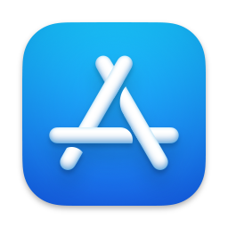
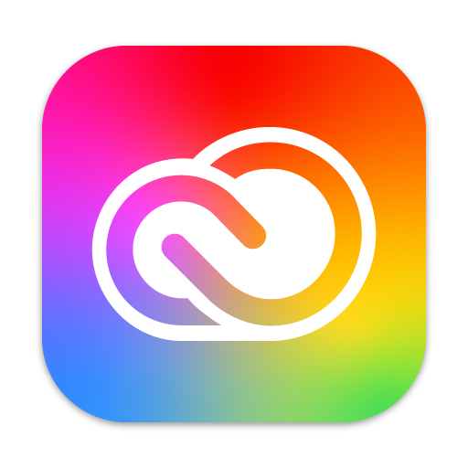
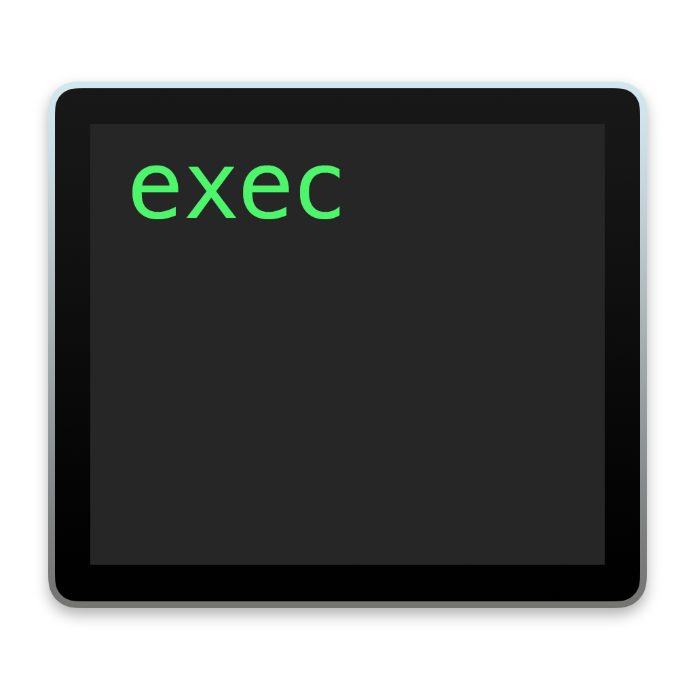
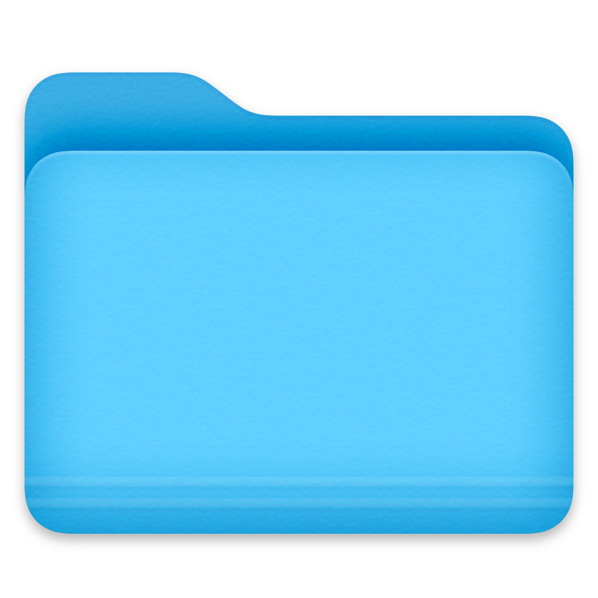
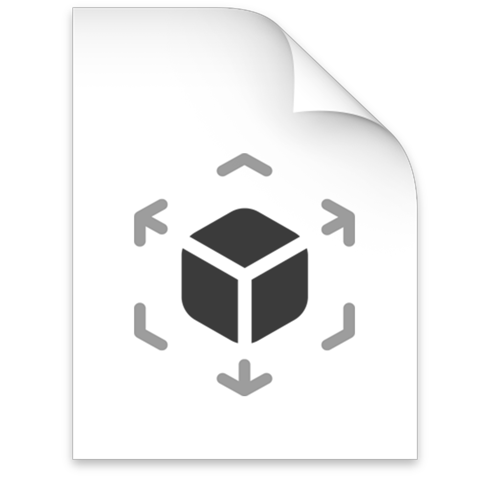
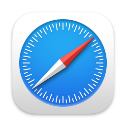
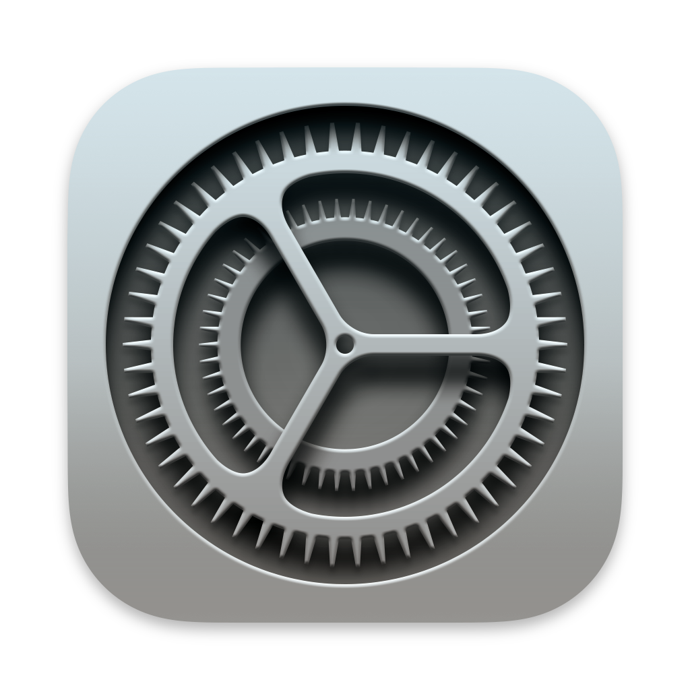
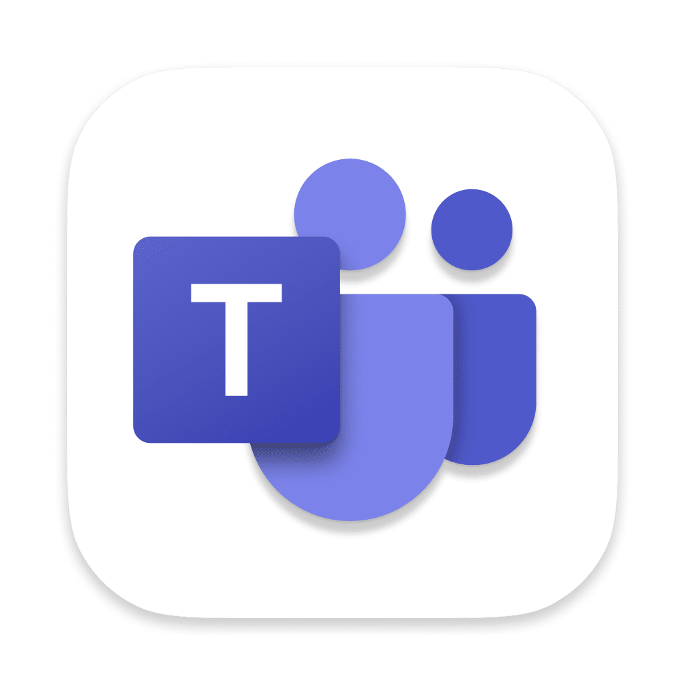

# bk_storage
This repository is used to store some binaries and thirs party ready to download

Available files:
 - htmlhelp.exe -> HTML Help Workshop Installer (to create .chm files)
                   Original link: https://web.archive.org/web/20160201063255/http:/download.microsoft.com/download/0/A/9/0A939EF6-E31C-430F-A3DF-DFAE7960D564/htmlhelp.exe
 - TheUnarchiver -> The unarchiving of zip version 4.3.5, which is the latest version to contain a quarantine tag flaw.
                   Original link: https://the-unarchiver.en.uptodown.com/mac/download/83550848

## macOS RedTeam Icon Library

This folder contains several icons in `.icns` format. You can preview and download them directly from the table below.
| Preview | Link | Tips | Appropriate module |
|---------|------|------|------|
|  | [AppStore.icns](https://github.com/sevagas/bk_storage/raw/refs/heads/main/macos-icon/Code.icns) | Can be used in the Privesc option, but in an App Store work environment, it may not be the best choice as it is not commonly used.| Privesc|
| | [ArchiveUtility.icns](https://github.com/sevagas/bk_storage/raw/refs/heads/main/macos-icon/archiveutility.icns) | Suitable for many situations; a user may agree to enter their password. With this type of icon, one could even imagine an attack using fatigue techniques (spamming the user with the prompt). | Privesc|
| | [VsCode.icns](https://github.com/sevagas/bk_storage/raw/refs/heads/main/macos-icon/Code.icns) | Can be used to spoof the icon for generating a .app or for privilege escalation, but it should align with the overall scenario. | Privesc / Fake app|
| | [CreativeCloudApp.icns](https://github.com/sevagas/bk_storage/raw/refs/heads/main/macos-icon/CreativeCloudApp.icns) | For Adobe users and its suite of software, this can be very powerful for privilege escalation. Similarly, Adobe is known for frequently spamming privilege requests to update its software. | Privesc|
| | [CreativeFolder.icns](https://github.com/sevagas/bk_storage/raw/refs/heads/main/macos-icon/creativefolder.icns) | For Adobe users, the logo on a fake .app, especially inside a .dmg container, could appear credible. | Fake app |
| | [ExecMacho.icns](https://github.com/sevagas/bk_storage/raw/refs/heads/main/macos-icon/ExecutableBinaryIcon.icns) | To spoof a .app, for example, by sending a new version of 7zip or in a scenario that requires making the user believe that a standalone executable is being sent. | Fake App|
| | [GenericDocument.icns](https://github.com/sevagas/bk_storage/raw/refs/heads/main/macos-icon/GenericDocumentIcon.icns) | To spoof a .app, making it appear as a powerful document, but not suitable for privilege escalation. | Fake App|
| | [GenericFolder.icns](https://github.com/sevagas/bk_storage/raw/refs/heads/main/macos-icon/GenericFolder.icns) | To spoof a .app, making it appear as a powerful document, but not suitable for privilege escalation—specifically within a .dmg, this can be quite effective. | Fake App|
| | [HomeFolder.icns](https://github.com/sevagas/bk_storage/raw/refs/heads/main/macos-icon/HomeFolderIcon.icns) | Can be useful in a privilege escalation scenario or for bypassing a TCC prompt, as it is "logical" for Finder to request admin access. | Privesc|
| | [Keychain.icns](https://github.com/sevagas/bk_storage/raw/refs/heads/main/macos-icon/key.icns) | Must be used cautiously, as it may raise suspicion. One could imagine sending a file that delivers certificates or credentials, where the icon is Keychain since the certificate would be handled by the Keychain app. | Privesc / Fake App |
| | [MSWord.icns](https://github.com/sevagas/bk_storage/raw/refs/heads/main/macos-icon/MSWD.icns) | Masquerading as a Word document can be relevant, although most documents already have the generic document icon by default. | Privesc / Fake App |
| | [Folder.icns](https://github.com/sevagas/bk_storage/raw/refs/heads/main/macos-icon/PicturesFolderIcon.icns) | Can be useful in a privilege escalation scenario or for bypassing a TCC prompt, as it is "logical" for Finder to request admin access. | Privesc |
| | [RealityFile.icns](https://github.com/sevagas/bk_storage/raw/refs/heads/main/macos-icon/RealityFile.icns) | Creating a fake 3D document can be useful in certain scenarios. | Fake App |
| | [Safari.icns](https://github.com/sevagas/bk_storage/raw/refs/heads/main/macos-icon/safari.icns) | Like other native applications, this can be very persuasive for a privilege escalation prompt. | Privesc |
| | [Settings.icns](https://github.com/sevagas/bk_storage/raw/refs/heads/main/macos-icon/settings.icns) | Settings is probably the best option for gaining root access. By first sending a system update notification and then triggering the prompt, it becomes extremely powerful. Similarly, spamming the prompt is possible. | Privesc|
|  | [MSTeams.icns](https://github.com/sevagas/bk_storage/raw/refs/heads/main/macos-icon/teams.icns) | In a work environment, a prompt for saving a file can be a logical choice. | Privesc / Fake App|
