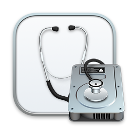
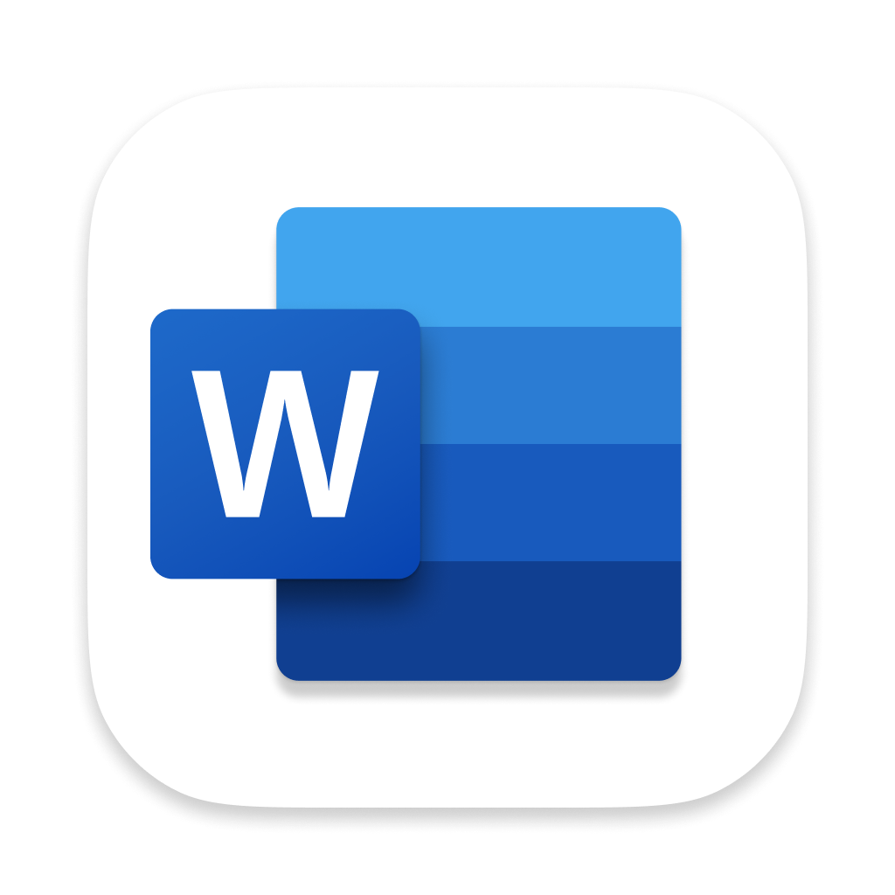
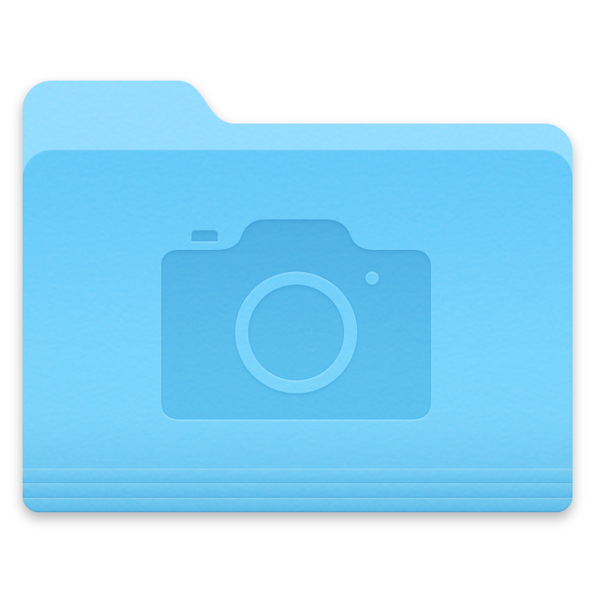

# bk_storage
This repository is used to store some binaries and thirs party ready to download

Available files:
 - htmlhelp.exe -> HTML Help Workshop Installer (to create .chm files)
                   Original link: https://web.archive.org/web/20160201063255/http:/download.microsoft.com/download/0/A/9/0A939EF6-E31C-430F-A3DF-DFAE7960D564/htmlhelp.exe
 - TheUnarchiver -> The unarchiving of zip version 4.3.5, which is the latest version to contain a quarantine tag flaw.
                   Original link: https://the-unarchiver.en.uptodown.com/mac/download/83550848

## macOS RedTeam Icon Library

This folder contains several icons in `.icns` format. You can preview and download them directly from the table below.
| Preview | Link | Tips |
|---------|------|------|
|  | [AppStore.icns](https://github.com/sevagas/bk_storage/raw/refs/heads/main/macos-icon/Code.icns) | test|
| | [ArchiveUtility.icns](https://github.com/sevagas/bk_storage/raw/refs/heads/main/macos-icon/archiveutility.icns) |  |
| | [VsCode.icns](https://github.com/sevagas/bk_storage/raw/refs/heads/main/macos-icon/Code.icns) |  |
| | [CreativeCloudApp.icns](https://github.com/sevagas/bk_storage/raw/refs/heads/main/macos-icon/CreativeCloudApp.icns) |  |
| | [CreativeFolder.icns](https://github.com/sevagas/bk_storage/raw/refs/heads/main/macos-icon/creativefolder.icns) |  |
| | [ExecMacho.icns](https://github.com/sevagas/bk_storage/raw/refs/heads/main/macos-icon/ExecutableBinaryIcon.icns) |  |
| | [GenericDocument.icns](https://github.com/sevagas/bk_storage/raw/refs/heads/main/macos-icon/GenericDocumentIcon.icns) |  |
| | [GenericFolder.icns](https://github.com/sevagas/bk_storage/raw/refs/heads/main/macos-icon/GenericFolder.icns) |  |
| | [HomeFolder.icns](https://github.com/sevagas/bk_storage/raw/refs/heads/main/macos-icon/HomeFolderIcon.icns) |  |
| | [Keychain.icns](https://github.com/sevagas/bk_storage/raw/refs/heads/main/macos-icon/key.icns) |  |
| | [MSWord.icns](https://github.com/sevagas/bk_storage/raw/refs/heads/main/macos-icon/MSWD.icns) |  |
| | [Folder.icns](https://github.com/sevagas/bk_storage/raw/refs/heads/main/macos-icon/PicturesFolderIcon.icns) |  |
| | [RealityFile.icns](https://github.com/sevagas/bk_storage/raw/refs/heads/main/macos-icon/RealityFile.icns) |  |
| | [Safari.icns](https://github.com/sevagas/bk_storage/raw/refs/heads/main/macos-icon/safari.icns) |  |
| | [Settings.icns](https://github.com/sevagas/bk_storage/raw/refs/heads/main/macos-icon/settings.icns) |  |
|  | [MSTeams.icns](https://github.com/sevagas/bk_storage/raw/refs/heads/main/macos-icon/teams.icns) |  |
